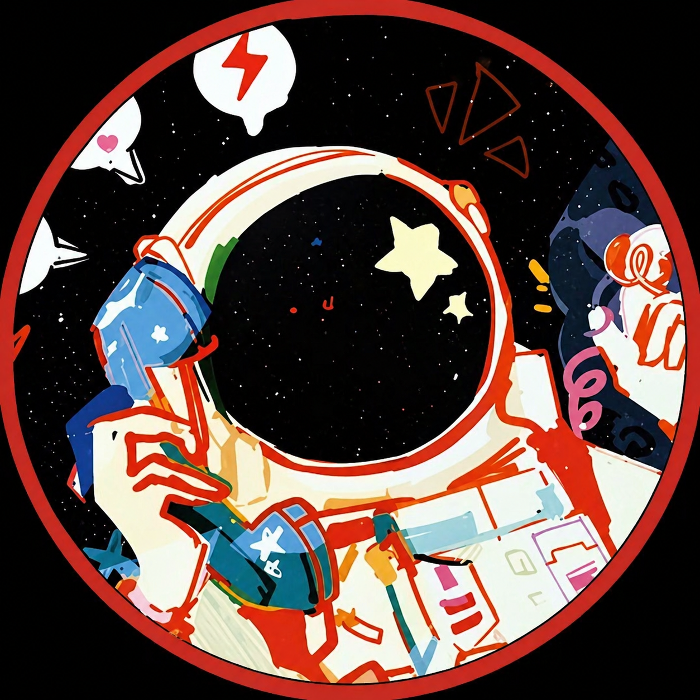

<!DOCTYPE html>
<html lang="en">
<head>
    <meta charset="UTF-8">
    <meta name="viewport" content="width=device-width, initial-scale=1.0">
    <title>Nexaura — Personal AI Operating System</title>
    
    <!-- Google Fonts -->
    <link href="https://fonts.googleapis.com/css2?family=JetBrains+Mono:wght@300;400;500;700;800&family=Outfit:wght@300;400;500;600;700;800;900&display=swap" rel="stylesheet">
    
    
</head>
<body>

<!-- NAVIGATION -->
<nav>
    

        

        Nexaura
    

    <ul class="nav-links">
        <li><a href="#architecture">Arch</a></li>
        <li><a href="#features">Features</a></li>
        <li><a href="#stack">Stack</a></li>
        <li><a href="#roadmap">Roadmap</a></li>
        <li><a href="#about">About</a></li>
        <li><a href="https://github.com/Sam-Dev-161127" class="nav-cta" target="_blank">GitHub →</a></li>
    </ul>
</nav>

<!-- LIVE TICKER -->

    

        Nexaura v2.1.0 STABLE
        PHASE 2 — PERCEPTION LAYER ACTIVE
        PYTHON 3.11.9 · GEMINI PRO · DEEPFACE
        WAKE WORD ENGINE: PORCUPINE ONLINE
        MEMORY VAULT: SQLITE3 WAL MODE
        LOCAL LLM FALLBACK: OLLAMA READY
        FLASK REMOTE: 192.168.x.x:5000
        ELEVENLABS TTS: STREAM CONNECTED
        <!-- Duplicated to enable smooth infinite scrolling -->
        Nexaura v2.1.0 STABLE
        PHASE 2 — PERCEPTION LAYER ACTIVE
        PYTHON 3.11.9 · GEMINI PRO · DEEPFACE
        WAKE WORD ENGINE: PORCUPINE ONLINE
        MEMORY VAULT: SQLITE3 WAL MODE
        LOCAL LLM FALLBACK: OLLAMA READY
        FLASK REMOTE: 192.168.x.x:5000
        ELEVENLABS TTS: STREAM CONNECTED
    

<!-- HERO SECTION -->
<section class="hero" style="padding-top:160px">
    <canvas id="particles-canvas"></canvas>
    
    

    

    

    

        
        Phase 2 Active · Perception Layer Online
    

    <h1 class="fade-in" style="position:relative; z-index:2">Nexaura</h1>
    
Personal · AI · Operating · System

    

        An intelligent, <strong>context-aware AI ecosystem</strong> that observes your environment, learns your workflow, and acts on your behalf — powered by <strong>Gemini Pro</strong> with persistent local memory.
    

    

        <a class="btn-glow" href="#architecture">Explore Architecture</a>
        <a class="btn-ghost" href="#features">View Features</a>
        <a class="btn-ghost" href="https://github.com/Sam-Dev-161127" target="_blank">GitHub ↗</a>
    

    <!-- Stats Panel -->
    

        

            
~140ms

            
Avg Response

        

        

            
9

            
Core Modules

        

        

            
0 bytes

            
Data Leaving Device

        

        

            
&lt;1%

            
Idle CPU Usage

        

    

    <!-- Typewriter Terminal -->
    

        

        

            

                

                    

                    

                    

                    
nexaura — main.py · python3.11

                    

                        
main.py

                        
config.py

                        
memory.py

                    

                

                

                    <!-- Populated dynamically via JS typewriter effect -->
                

            

        

    

</section>

<!-- ARCHITECTURE SECTION -->
<section id="architecture" style="background:var(--bg2); border-top:1px solid var(--border)">
    

        
System Architecture

        
Development Pipeline

        
Nexaura follows a strict four-stage data pipeline from environment setup to cognitive output. Each stage is independently testable and extensible.

        

            

                

                    <!-- Node 1: IDE -->
                    

                        
[ IDE ]

                        
Stage 01 · Setup

                        
PyCharm Professional

                        
Project indexing, vEnv management, and intelligent autocompletion for Gemini SDK and DeepFace libraries.

                        
Read IDE Docs →

                    

                    
                    
→

                    <!-- Node 2: ENV -->
                    

                        
[ ENV ]

                        
Stage 02 · Runtime

                        
Python 3.11.9 vEnv

                        
Isolated virtual environment with CPython's adaptive specializing interpreter for 60% threading performance gains.

                        
Read ENV Docs →

                    

                    
                    
→

                    <!-- Node 3: DAT -->
                    

                        
[ DAT ]

                        
Stage 03 · Sensing

                        
Multimodal Input Layer

                        
DeepFace vision, Porcupine wake word, OpenCV streams, and SQLite WAL mode operating in parallel threads.

                        
Read DAT Docs →

                    

                    
                    
→

                    <!-- Node 4: LOG -->
                    

                        
[ LOG ]

                        
Stage 04 · Cognition

                        
Gemini Logic Engine

                        
Multimodal context injection into Gemini Pro with strict JSON output enforcement for deterministic OS automation.

                        
Read LOG Docs →

                    

                

                <!-- Architectural Details -->
                

                    

                        
Input Layer

                        
Audio → Porcupine STT

                        
Edge-computed acoustic wake word triggering near-zero CPU interrupt on voice activation.

                    

                    

                        
Vision Layer

                        
Camera → DeepFace CNN

                        
Non-blocking 10fps BGR frame sampling, emotion logit array cached in global state.

                    

                    

                        
Memory Layer

                        
SQLite3 WAL Vault

                        
Asynchronous read/write with LRU cache; context serialized as JSON blobs for LLM injection.

                    

                

            

        

    

</section>

<!-- FEATURES SECTION -->
<section id="features">
    

        
System Capabilities

        
The Nexaura Feature Suite

        
Nine production-grade modules working in concert. Click any card to read full technical documentation and integration guides.

        

            <!-- Memory Feature -->
            

                

                
[ MEM ] Memory

                
Persistent Context Memory

                
SQLite3 vault with Write-Ahead Logging builds a dynamic interaction graph — habits, tool preferences, and workflow sequences, all persisted across sessions.

                

                    
● Active

                    
Read Docs →

                

            

            <!-- Wake Word Feature -->
            

                

                
[ MIC ] Audio

                
Porcupine Wake Word Engine

                
Picovoice Porcupine runs entirely on-device using cross-correlation acoustic modeling. Zero audio bytes leave the machine before the interrupt threshold is triggered.

                

                    
● Active

                    
Read Docs →

                

            

            <!-- Emotion Recognition Feature -->
            

                

                
[ VIS ] Vision

                
DeepFace Emotion Recognition

                
CNN-based facial landmark analysis via VGG-Face/Facenet models sampling at 10fps. Emotion state injected into Gemini system prompt for adaptive tone modulation.

                

                    
● Active

                    
Read Docs →

                

            

            <!-- Plugins Feature -->
            

                

                
[ EXT ] Extension

                
Plugin Hot-Reloading

                
Watchdog monitors /plugins/ directory via importlib and os.walk. New Python modules dynamically mounted into the OS namespace with strict error boundaries preventing core crashes.

                

                    
● Active

                    
Read Docs →

                

            

            <!-- OS Automation Feature -->
            

                

                
[ CMD ] Control

                
OS Automation Hub

                
NLP-to-system-interrupt translation via PyAutoGUI and subprocess. Maps display resolutions, emulates keyboard hardware, executes template-matched mouse clicks and shell pipelines.

                

                    
● Active

                    
Read Docs →

                

            

            <!-- Mobile Remote Feature -->
            

                

                
[ NET ] Network

                
Flask Mobile Remote

                
Lightweight Werkzeug WSGI server on a background thread, bound to 0.0.0.0:5000. Exposes RESTful endpoints for remote command execution over local subnet.

                

                    
● Active

                    
Read Docs →

                

            

            <!-- Voice TTS Feature -->
            

                

                
[ VOC ] Voice

                
ElevenLabs Neural TTS

                
Studio-grade neural speech synthesis bypassing legacy pyttsx3/SAPI5 engines. Stability, similarity_boost, and style scaling are programmatically controlled per emotional context.

                

                    
● Active

                    
Read Docs →

                

            

            <!-- Security Feature -->
            

                

                
[ SEC ] Security

                
Air-Gapped Local Execution

                
Wake word modeling, facial CNN matrices, and SQLite graph construction run entirely on edge hardware. Only sanitized NLP text reaches external APIs — zero raw sensor data egress.

                

                    
● Active

                    
Read Docs →

                

            

            <!-- Local LLM Fallback -->
            

                

                
[ LCL ] Fallback

                
Local LLM via Ollama

                
Automatic failover routing to quantized local models (Llama 3 8B) via Ollama daemon when Gemini API times out or the device goes air-gapped. Transparent to the user.

                

                    
○ Standby

                    
Read Docs →

                

            

        

    

</section>

<!-- TECH STACK SECTION -->

    <section id="stack">
        

            
Technology

            
System Stack

            
Every library and framework selected for minimum overhead and maximum reliability on local edge hardware.

            

                

                    
Engine

                    
Python 3.11.9

                    
CPython Stable

                    
Adaptive Specializing Interpreter

                    
View Docs →

                

                

                    
AI Brain

                    
Gemini Pro

                    
google-generativeai SDK

                    
Multimodal LLM · JSON Output

                    
View Docs →

                

                

                    
Vision CNN

                    
DeepFace

                    
VGG-Face / Facenet

                    
Emotion · Identity Recognition

                    
View Docs →

                

                

                    
Persistence

                    
SQLite3

                    
WAL Mode Enabled

                    
Async Memory Vault

                    
View Docs →

                

                

                    
Desktop GUI

                    
PyQt6

                    
Qt C++ Bindings

                    
GPU-Accelerated Overlay

                    
View Docs →

                

                

                    
Remote API

                    
Flask + Werkzeug

                    
WSGI Server

                    
Mobile REST Endpoint

                    
View Docs →

                

                
                

                    
Audio Input

                    
SpeechRecognition

                    
Python Module

                    
Voice-to-Text Conversion

                    
View Docs →

                

                

                    
Offline TTS

                    
pyttsx3

                    
SAPI5 Engine

                    
Text-to-Speech Output

                    
View Docs →

                

                

                    
Security

                    
python-dotenv

                    
Config Manager

                    
API Key Management

                    
View Docs →

                

                <!-- NEW STACK CARDS EXTRACTED FROM NEXAURA FEATURES -->
                

                    
Web Control

                    
webbrowser

                    
Python Std Library

                    
Automated Site Navigation

                    
View Docs →

                

                

                    
Network

                    
requests

                    
HTTP Library

                    
Fetch Info & APIs

                    
View Docs →

                

                

                    
System OS

                    
os

                    
Python Std Library

                    
Launch Desktop Apps

                    
View Docs →

                

                <!-- END OF NEW CARDS -->

            

        

    </section>

<!-- ROADMAP SECTION -->
<section id="roadmap" style="background:var(--bg2); border-top:1px solid var(--border)">
    

        
Vision

        
Nexaura Roadmap

        
Five-phase evolution from a local AI assistant to a full physical-world operating system.

        

            <!-- Phase 1 -->
            

                

                    

                

                

                    
Phase 1 · Foundation ✓ COMPLETED

                    
Core OS Architecture

                    
Stable Python 3.11 build, SQLite memory integration, basic voice-to-action pipeline, PyCharm development environment, and initial Gemini API routing.

                    

                        Python 3.11.9
                        SQLite3 Vault
                        Gemini API
                        ElevenLabs TTS
                    

                

            

            <!-- Phase 2 -->
            

                

                    

                

                

                    
Phase 2 · Perception ◉ IN PROGRESS

                    
Advanced Sensing Layer

                    
DeepFace emotion tracking, Porcupine wake word engine, MediaPipe gesture control, and multimodal context injection into the Gemini prompt pipeline.

                    

                        DeepFace CNN
                        Porcupine STT
                        MediaPipe
                        Context Injection
                    

                

            

            <!-- Phase 3 -->
            

                

                    

                

                

                    
Phase 3 · Integration · UPCOMING

                    
Universal Plugin Marketplace

                    
Hot-reloadable community plugin ecosystem with sandboxed execution. Planned connectors: Weather, Stocks, Spotify, IDE control, Smart Home, and Calendar sync.

                    

                        Plugin SDK
                        Watchdog FS
                        Sandboxing
                        Community Hub
                    

                

            

            <!-- Phase 4 -->
            

                

                    

                

                

                    
Phase 4 · Intelligence · PLANNED

                    
Behavioral Prediction Engine

                    
AI proactively predicts workflow needs based on time-of-day, historical SQLite patterns, and biometric state. Nexaura acts before you ask.

                    

                        Time-Series Analysis
                        Pattern Recognition
                        Proactive Actions
                    

                

            

            <!-- Phase 5 -->
            

                

                    

                

                

                    
Phase 5 · Physical · FUTURE

                    
Hardware &amp; Robotics Integration

                    
Raspberry Pi 5 edge deployment, Arduino sensor networks, IoT device control, and robotic arm actuation — bridging the digital OS into physical space.

                    

                        Raspberry Pi 5
                        Arduino I/O
                        IoT Mesh
                        Robotics
                    

                

            

        

    

</section>

<!-- ABOUT SECTION -->
<section id="about">
    

        
Developer

        
About the Builder

        

            <!-- Left Column: Terminal Bio & Directives -->
            

                

                    

                        
                        
                        
                        sameer@nexaura:~$ whoami --verbose
                    

                    

                        

                            
                            
SP

                            

                                
Sameer Patra

                                
@Sam-Dev-161127

                                
📍 Balasore, Odisha, India

                                

                                    <a href="mailto:sam.dev1611@gmail.com" style="color:inherit; text-decoration:none">sam.dev1611@gmail.com</a>
                                

                            

                        

                        <ul class="tb-list">
                            <li>Student developer — engineering since 2024</li>
                            <li>Focus: Python · Web Dev · Robotics · AI</li>
                            <li>Building physics games in Godot Engine</li>
                            <li>NIELIT AI/ML Internship graduate</li>
                            <li>Goal: Become an engineer who ships real things</li>
                        </ul>
                        

                            Godot Dev
                            Python
                            Linux Ubuntu
                            AI / ML
                            Robotics
                            Web Dev
                        

                    

                

                

                    
[ DIR ] Active Directives

                    <ul class="about-list">
                        <li>Developing physics-based game mechanics in <strong>Godot Engine</strong></li>
                        <li>Mastering async patterns in <strong>Python 3.11</strong></li>
                        <li>Exploring embedded systems and <strong>Robotics</strong></li>
                        <li>Studying <strong>Mathematics</strong> for algorithm design</li>
                    </ul>
                

            

            <!-- Right Column: Certifications & Skills -->
            

                

                    
CERT

                    

                        
Crash Course on Python

                        
Authorized by Google · Coursera

                        
✓ Completed: May 11, 2026

                        <a href="https://coursera.org/verify/IKPW8JE4BPJP" target="_blank" class="cert-link">Verify Credential →</a>
                    

                

                

                    
Achievements

                    <ul class="about-list">
                        <li>Completed a <strong>5-Day NIELIT Internship</strong> on AI &amp; Machine Learning using Python.</li>
                        <li>Built beginner-level <strong>AI assistant and automation</strong> projects independently.</li>
                        <li>Proficient in <strong>VS Code, PyCharm</strong>, and modern development tooling.</li>
                        <li>Passionate about <strong>robotics</strong> and innovative engineering.</li>
                        <li>Skilled in <strong>Canva and PowerPoint</strong> for technical presentation design.</li>
                    </ul>
                

                

                    
Technical Skills &amp; Tools

                    

                        Python
                        Godot Engine
                        PyCharm
                        VS Code
                        Linux
                        AI / ML Basics
                        Git &amp; GitHub
                        Web Dev
                        Canva
                    

                

            

        

    

</section>

<!-- AUTHOR FOOTER SECTION -->
<section class="author-section">
    

        
        
SP

        
Sameer Patra

        
// lead architect · nexaura systems · 2026

        
        

            <a class="author-link" href="https://github.com/Sam-Dev-161127" target="_blank">
                <svg viewBox="0 0 24 24"><path d="M12 0C5.37 0 0 5.37 0 12c0 5.31 3.435 9.795 8.205 11.385.6.105.825-.255.825-.57 0-.285-.015-1.23-.015-2.235-3.015.555-3.795-.735-4.035-1.41-.135-.345-.72-1.41-1.23-1.695-.42-.225-1.02-.78-.015-.795.945-.015 1.62.87 1.845 1.23 1.08 1.815 2.805 1.305 3.495.99.105-.78.42-1.305.765-1.605-2.67-.3-5.46-1.335-5.46-5.925 0-1.305.465-2.385 1.23-3.225-.12-.3-.54-1.53.12-3.18 0 0 1.005-.315 3.3 1.23.96-.27 1.98-.405 3-.405s2.04.135 3 .405c2.295-1.56 3.3-1.23 3.3-1.23.66 1.65.24 2.88.12 3.18.765.84 1.23 1.905 1.23 3.225 0 4.605-2.805 5.625-5.475 5.925.435.375.81 1.095.81 2.22 0 1.605-.015 2.895-.015 3.285 0 .315.225.69.825.57A12.02 12.02 0 0024 12c0-6.63-5.37-12-12-12z"/></svg>
                GitHub
            </a>
            <a class="author-link" href="https://www.linkedin.com/in/sameer-patra-2b17a83a7" target="_blank">
                <svg viewBox="0 0 24 24"><path d="M20.447 20.452h-3.554v-5.569c0-1.328-.027-3.037-1.852-3.037-1.853 0-2.136 1.445-2.136 2.939v5.667H9.351V9h3.414v1.561h.046c.477-.9 1.637-1.85 3.37-1.85 3.601 0 4.267 2.37 4.267 5.455v6.286zM5.337 7.433a2.062 2.062 0 01-2.063-2.065 2.064 2.064 0 112.063 2.065zm1.782 13.019H3.555V9h3.564v11.452zM22.225 0H1.771C.792 0 0 .774 0 1.729v20.542C0 23.227.792 24 1.771 24h20.451C23.2 24 24 23.227 24 22.271V1.729C24 .774 23.2 0 22.222 0h.003z"/></svg>
                LinkedIn
            </a>
            <a class="author-link" href="https://x.com/Sam_Dev_161127" target="_blank">
                <svg viewBox="0 0 24 24"><path d="M18.244 2.25h3.308l-7.227 8.26 8.502 11.24H16.17l-5.214-6.817L4.99 21.75H1.68l7.73-8.835L1.254 2.25H8.08l4.713 6.231zm-1.161 17.52h1.833L7.084 4.126H5.117z"/></svg>
                Twitter / X
            </a>
            <a class="author-link" href="https://www.instagram.com/sam.dev.161127" target="_blank">
                <svg viewBox="0 0 24 24"><path d="M12 2.163c3.204 0 3.584.012 4.85.07 3.252.148 4.771 1.691 4.919 4.919.058 1.265.069 1.645.069 4.849 0 3.205-.012 3.584-.069 4.849-.149 3.225-1.664 4.771-4.919 4.919-1.266.058-1.644.07-4.85.07-3.204 0-3.584-.012-4.849-.07-3.26-.149-4.771-1.699-4.919-4.92-.058-1.265-.07-1.644-.07-4.849 0-3.204.013-3.583.07-4.849.149-3.227 1.664-4.771 4.919-4.919 1.266-.057 1.645-.069 4.849-.069zM12 0C8.741 0 8.333.014 7.053.072 2.695.272.273 2.69.073 7.052.014 8.333 0 8.741 0 12c0 3.259.014 3.668.072 4.948.2 4.358 2.618 6.78 6.98 6.98C8.333 23.986 8.741 24 12 24c3.259 0 3.668-.014 4.948-.072 4.354-.2 6.782-2.618 6.979-6.98.059-1.28.073-1.689.073-4.948 0-3.259-.014-3.667-.072-4.947-.196-4.354-2.617-6.78-6.979-6.98C15.668.014 15.259 0 12 0zm0 5.838a6.162 6.162 0 100 12.324 6.162 6.162 0 000-12.324zM12 16a4 4 0 110-8 4 4 0 010 8zm6.406-11.845a1.44 1.44 0 100 2.881 1.44 1.44 0 000-2.881z"/></svg>
                Instagram
            </a>
            <a class="author-link" href="https://t.me/Sameer161127" target="_blank">
                <svg viewBox="0 0 24 24"><path d="M11.944 0A12 12 0 000 12a12 12 0 0012 12 12 12 0 0012-12A12 12 0 0012 0a12 12 0 00-.056 0zm4.962 7.224c.1-.002.321.023.465.14a.506.506 0 01.171.325c.016.093.036.306.02.472-.18 1.898-.962 6.502-1.36 8.627-.168.9-.499 1.201-.82 1.23-.696.065-1.225-.46-1.9-.902-1.056-.693-1.653-1.124-2.678-1.8-1.185-.78-.417-1.21.258-1.91.177-.184 3.247-2.977 3.307-3.23.007-.032.014-.15-.056-.212s-.174-.041-.249-.024c-.106.024-1.793 1.14-5.061 3.345-.48.33-.913.49-1.302.48-.428-.008-1.252-.241-1.865-.44-.752-.245-1.349-.374-1.297-.789.027-.216.325-.437.892-.663 3.498-1.524 5.83-2.529 6.998-3.014 3.332-1.386 4.025-1.627 4.476-1.635z"/></svg>
                Telegram
            </a>
        

    

</section>

<footer>⬡ NEXAURA SYSTEMS &nbsp;·&nbsp; BUILT IN PYTHON 3.11.9 &nbsp;·&nbsp; SAMEER PATRA &nbsp;·&nbsp; 2026</footer>

<!-- DYNAMIC MODAL -->

    

        
[ ESC ]

        

            

            

                

                

            

        

        

        
Technical Integration Guide

        

        

    

</body>
</html>